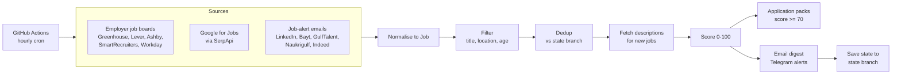

# Job Hunter

A hands-off job search that runs every hour on GitHub Actions. It:

1. pulls fresh postings from employers' own job boards, Google for Jobs, and the job-alert emails boards send you;
2. filters and scores them against a search profile (`config.yaml`);
3. keeps only jobs you have **not** seen before;
4. emails a digest (plus optional Telegram alerts for top matches);
5. prepares an **application pack** for the best matches: CV tailored from `profile.yaml`, cover letter draft, standard screening answers.

You review the pack and submit the application yourself. Nothing is auto-submitted.

## How it works



| Step | What happens | Code |
|---|---|---|
| Fetch | Each enabled source returns every current posting it can see. Sources run in parallel; one failing board does not stop the others. | `jobhunter/sources/` |
| Filter | A title must contain a `title_include` phrase and no `title_exclude` phrase (**title only**, so "work with senior stakeholders" in a description doesn't reject a job). Location must match `locations`. Postings older than `max_age_days` are dropped. | `filtering.py` |
| Dedup | The same job on two boards is collapsed (same URL, or same company + title). Jobs already in the state file are dropped, so each job reaches you once. | `filtering.py`, `state.py` |
| Enrich | For *new* jobs only, descriptions are fetched from boards whose listings don't include them (Greenhouse, SmartRecruiters, Workday). | `pipeline.py` |
| Score | 40 for a title match (+5 per extra title phrase), +4 per keyword (max 30), +6 per entry-level signal (max 15), −15 per penalty ("7+ years", "Arabic speaker", "Manager" in title...), +10 preferred city, +5 if posted in the last 3 days. Every score comes with its reasons. | `scoring.py` |
| Packs | For scores ≥ 70: tailored CV, cover letter, answers, job description, in `applications/` on the `state` branch. | `apply/pack.py` |
| Notify | HTML + text email to you; Telegram for scores ≥ 70. No email when nothing is new. | `notify/` |
| Save | Seen jobs + per-source last-run times are committed to the `state` branch, keeping `main` history clean. | `.github/workflows/job-hunter.yml` |

## Where the jobs come from

| Source | Covers | Cost | Needs | Blocking risk |
|---|---|---|---|---|
| `greenhouse`, `lever`, `ashby`, `smartrecruiters`, `workday` | Target employers' own hiring systems. Configured now: Careem, Tamara, OKX, Stripe, Databricks, MongoDB, Datadog, Binance, Fresha, Ziina, **Roland Berger**, **Oliver Wyman / Marsh McLennan**, **Accenture**, Mastercard, Citi | Free | Nothing | None: public JSON APIs meant for job boards |
| `serpapi` | Google for Jobs, which aggregates LinkedIn, Bayt, GulfTalent, Indeed and company sites | Free tier, paid above (check current quota) | `SERPAPI_KEY` | None (SerpApi's problem, not yours) |
| `gmail_alerts` | Alerts **you** set up on LinkedIn, Bayt, GulfTalent, Naukrigulf, Indeed | Free | Gmail app password + alerts created | None: it only reads your own inbox |

It deliberately does **not** scrape LinkedIn/Bayt/GulfTalent pages or log in to them: that is what gets accounts restricted and scrapers broken.

**Honest expectations.** The first live run (Sep 2026) scanned ~3,600 postings from the employer boards in ~35 seconds, but only a handful were entry-level strategy roles in the GCC: big consulting firms post few openings on public boards. The volume comes from `gmail_alerts` and `serpapi`, so set those up. The email parser is best-effort and should be checked against real alert emails once they arrive (see "Troubleshooting").

## Setup plan

### Step 1: Try it locally (10 minutes)

Python 3.9+ recommended (CI uses 3.12; the code also runs on 3.7).

```bash
python -m venv .venv
source .venv/Scripts/activate          # Windows Git Bash; macOS/Linux: source .venv/bin/activate
pip install -r requirements-dev.txt
python -m pytest                       # offline tests
python -m jobhunter doctor             # what is configured / missing
python -m jobhunter run --dry-run      # live fetch, nothing sent, no state saved
```

Open `output/digest.html` to see what the email would look like and `output/applications/` for packs.

### Step 2: Put it on GitHub (the hands-off part)

1. Create a **private** GitHub repository (profile.yaml contains contact details) and push `main`.
2. **Settings → Secrets and variables → Actions → New repository secret**, add what you want to use:

   | Secret | Required for | How to get it |
   |---|---|---|
   | `GMAIL_ADDRESS` | email digest, alert emails | The Gmail account that receives job alerts |
   | `GMAIL_APP_PASSWORD` | email digest, alert emails | Google Account → Security → 2-Step Verification → App passwords → create one (16 characters) |
   | `DIGEST_TO` | optional | Comma-separated recipients; defaults to `GMAIL_ADDRESS` |
   | `TELEGRAM_BOT_TOKEN` | optional instant alerts | Message @BotFather → `/newbot` |
   | `TELEGRAM_CHAT_ID` | optional instant alerts | Send your bot a message, open `https://api.telegram.org/bot<token>/getUpdates`, copy `chat.id` |
   | `SERPAPI_KEY` | optional Google for Jobs | serpapi.com account |
   | `ANTHROPIC_API_KEY` | optional Claude-written cover letters | console.anthropic.com (roughly a cent per pack with Haiku) |

3. **Actions → job-hunter → Run workflow**, tick *Dry run* first. Check the log and download the `digest-…` artifact.
4. Run it again without *Dry run*. The first real run creates the `state` branch; after that the hourly schedule runs on its own.

Any source whose secrets are missing is skipped, not failed, so you can add secrets one at a time.

### Step 3: Create the job alerts that feed `gmail_alerts`

Use the same inbox as `GMAIL_ADDRESS`:

- **LinkedIn:** search e.g. *Strategy Analyst*, location *United Arab Emirates*, filters *Entry level / Associate* and *Past 24 hours* → **Set alert** (daily). Repeat for *Saudi Arabia* and *Qatar*, and for *Business Analyst*, *Associate Consultant*, *Graduate Programme*.
- **Bayt, GulfTalent, Naukrigulf, Indeed (ae.indeed.com):** create saved searches with email alerts for the same titles and countries.

### Step 4: Fill in `profile.yaml`

`python -m jobhunter doctor` lists the `standard_answers` still marked TODO (nationality, visa sponsorship, notice period, expected salary...). Fill them in once and every application pack uses them.

## Day-to-day

- **Results:** email digest; Telegram for top matches; packs under `applications/` on the `state` branch (linked from the digest).
- **When something breaks:** if every source fails or every notification fails, the run goes red and GitHub emails you. If notifications fail, state is not saved, so the next run retries. Partial problems (one board down) are listed at the bottom of the digest.
- **Cost:** about 1 Actions minute per run × 24/day ≈ 720 of the 2,000 free minutes/month for private repos.
- **Timing:** GitHub cron is best-effort and runs can be delayed. The wide age window plus dedup means late runs lose nothing.

## Commands

| Command | Purpose |
|---|---|
| `python -m jobhunter run` | Full run: fetch, filter, score, notify, save state |
| `python -m jobhunter run --dry-run` | Nothing sent, no state saved; writes `output/` |
| `python -m jobhunter run --only workday,smartrecruiters` | Just some sources (also bypasses `min_interval_hours`) |
| `python -m jobhunter run --ignore-seen` | Treat every job as new (useful after changing scoring) |
| `python -m jobhunter doctor` | Show ready/missing sources, secrets, profile TODOs |
| `python -m jobhunter probe careem talabat noon` | Find which public ATS board a company uses |
| `python -m jobhunter pack --url URL --title T --company C --description-file jd.txt` | Build a pack for a job you found yourself, e.g. on LinkedIn |
| `python -m pytest tests/test_sources.py::test_workday_multi_location_uses_search_term` | Run a single test |

## Customising

- **Tune the search:** edit `search_profiles` in `config.yaml`. Everything is phrases matched as whole words, case-insensitive.
- **Add employers:** `python -m jobhunter probe <slug>...` and add hits under `greenhouse` / `lever` / `ashby` / `smartrecruiters`. For **Workday**, open the company careers site; its URL looks like `https://<tenant>.wd<N>.myworkdayjobs.com/<site>`, which gives `host`, `tenant` and `site`.
- **Another profession:** copy the disabled `data-engineering-gcc` example profile and enable it.
- **Another person:** replace `profile.yaml` and the search profiles.
- **Another board:** add a module in `jobhunter/sources/` subclassing `Source` (implement `fetch()`, optionally `enrich()`), then register it in `jobhunter/sources/__init__.py`. Its position in `SOURCE_CLASSES` sets dedup priority.

## Application packs

Each pack folder holds `README.md` (score, reasons, checklist, job description), `cv_tailored.md`, `cover_letter.md`, `answers.yaml` and `job.json`.

- **Without `ANTHROPIC_API_KEY`:** deterministic. CV bullets are re-ordered by relevance to the posting but never reworded; the cover letter is a template around the three most relevant achievements.
- **With it:** Claude drafts the summary, cover letter, talking points and a list of *gaps* (requirements your profile doesn't show). The prompt forbids inventing facts, and contact details and screening answers are not sent.

**Next phase (not built yet):** a local `apply` command that opens the job in a browser on your laptop, pre-fills Greenhouse / Lever / Ashby forms from the pack, and stops at the Submit button for you.

## Troubleshooting

- **A board shows errors:** the company may have changed ATS. Re-run `probe`, or remove it from `config.yaml`.
- **Alert emails produce no jobs:** check the Actions log for `gmail_alerts`, then compare a real alert email's job links with `BOARD_PATTERNS` in `jobhunter/sources/email_parsers.py` and add a test with that HTML.
- **Too many / too few matches:** adjust `title_include`, `title_exclude`, `digest.min_score`, then run `run --dry-run --ignore-seen` to preview.
